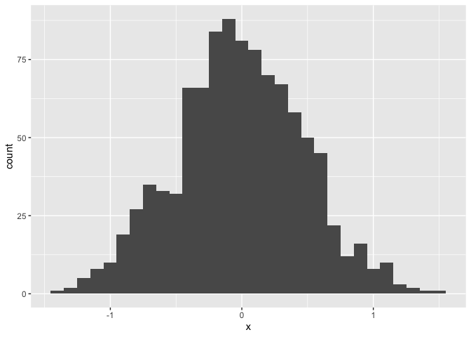
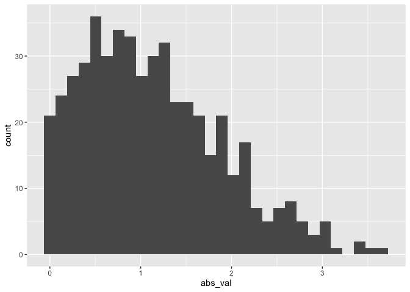

Simple document
================
Lydia Parr
9/16/21

\#table of contents added with code abv, collapse code, can also do pdf
\#better not to do word because not editable \#rmd is preferable for
writng, use them for hw, can also do output for github

``` r
library(tidyverse)
```

    ## ── Attaching packages ─────────────────────────────────────── tidyverse 1.3.1 ──

    ## ✓ ggplot2 3.3.4     ✓ purrr   0.3.4
    ## ✓ tibble  3.1.2     ✓ dplyr   1.0.7
    ## ✓ tidyr   1.1.3     ✓ stringr 1.4.0
    ## ✓ readr   1.4.0     ✓ forcats 0.5.1

    ## ── Conflicts ────────────────────────────────────────── tidyverse_conflicts() ──
    ## x dplyr::filter() masks stats::filter()
    ## x dplyr::lag()    masks stats::lag()

\#\#knitting will print— also knitting will show errors, so do it
frequently \#\# because it creates new r session

I’m an R Markdown document! (notice this part just looks like text

# Section 1

Here’s a **code chunk** that samples from a *normal distribution*:
(abvfromatting does bolding and italics respectively) (below 3 backtics
and a curly bracket for r code- it’ll be in a chunk

``` r
samp = rnorm(100)
length(samp)
```

    ## [1] 100

# Section 2

(you can put everything in the same place and it’ll all work–
calculations are included in the html file) I can take the mean of the
sample, too! The mean is -0.075879.

# Section 3

Let’s write a new code code (option+command+i instead of backticks for
hotkeys) (name code chunk, the text after r to help make troubleshooting
easier)

options for code chunks to put in brackets after r {r} eval = FALSE:
code will be displayed but not executed; results are not included. echo
= FALSE: code will be executed but not displayed; results are included.
include = FALSE: code won’t be executed or displayed. message = FALSE
and warning = FALSE: prevents messages and warnings from being
displayed. results = hide and fig.show = hide: prevents results and
figures from being shown, respectively. collapse = TRUE: output will be
collapsed into a single block at shown at the end of the chunk. error:
errors in code will stop rendering when FALSE; errors in code will be
printed in the doc when TRUE. The default is FALSE and you should almost
never change it.

This code chunk imports the ‘tidyverse’ package, creates a dataframe,
and makes a histogram.

(could also load tidyverse in earlier code chunk and it’d be available
early on first code chunk ideally would load all packages/libraries
you’ll need to use)

``` r
##once files are in the same folder : create a new project, thing called project saves trouble
# use a folder on computer as an existing directory 

#also make sure what's inside tibble is reffed in 
#the line of code you save

plot_df = 
  tibble(
    x = rnorm(1000, sd = .5),
    y = 1 + 2 * x + rnorm(1000)
  )


plot_df = 
  tibble(
    x = rnorm(1000, sd = .5),
    y = 1 + 2 * x + rnorm(1000)
  )


plot_df ##kind of thing you can just put in console 
```

    ## # A tibble: 1,000 x 2
    ##            x      y
    ##        <dbl>  <dbl>
    ##  1 -0.575     0.715
    ##  2 -0.229     2.04 
    ##  3  0.000510  1.07 
    ##  4  0.148     0.854
    ##  5  0.399     2.02 
    ##  6 -0.130     0.775
    ##  7 -0.365     0.446
    ##  8  0.0699   -0.125
    ##  9  0.0623    2.17 
    ## 10 -0.825     0.252
    ## # … with 990 more rows

``` r
ggplot(plot_df, aes(x = x)) + geom_histogram()
```

    ## `stat_bin()` using `bins = 30`. Pick better value with `binwidth`.

<!-- -->

``` r
##abv, made plot, told it x goes on x axis 
# ggplot was told to only look inside the plot 
#dataframe for the variables
## below, scatter not histo, x goes on x y goes on y
```

not everything will go into console– run chunks individually by
highlighting and executing in console as if using an r script

Learning assessment

``` r
?rnorm##(to check what it does)
#remember to google and use the r search function
#okay to copu and paste if you understand what you're doing too 

#Write a named code chunk that creates a dataframe comprised of: a numeric variable containing a random sample of size 500 from a normal variable with mean 1; a logical vector indicating whether each sampled value is greater than zero; and a numeric vector containing the absolute value of each element. Then, produce a histogram of the absolute value variable just created. 

library(tidyverse)
set.seed(12)

learning_df = 
  tibble(
    sample = rnorm(500, mean = 1),
    gr_than_0 = sample > 0,
    abs_val = abs(sample)
  )

ggplot(learning_df, aes(x = abs_val)) + geom_histogram()
```

    ## `stat_bin()` using `bins = 30`. Pick better value with `binwidth`.

<!-- --> ormatting text
There are a huge number of ways to format your documents. The overview
below is essentially copied from R for Data Science; a link to a handy
cheatsheet is below.

## Text formatting

*italic* or *italic* **bold** or **bold** `code` superscript<sup>2</sup>
and subscript<sub>2</sub>

## Headings

# 1st Level Header

## 2nd Level Header

### 3rd Level Header

## Lists

-   Bulleted list item 1

-   Item 2

    -   Item 2a

    -   Item 2b

1.  Numbered list item 1

2.  Item 2. The numbers are incremented automatically in the output.

## Tables

| First Header | Second Header |
|--------------|---------------|
| Content Cell | Content Cell  |
| Content Cell | Content Cell  |
